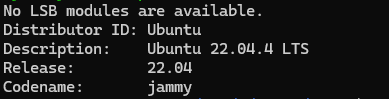
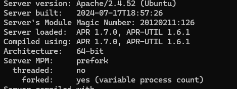
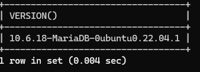
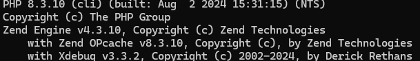

# Installation Process
## For development
### Virtual Machine
#### VirtualBox
Install **Silecust** on [Oracle VirtualBox](development/vm/virtualbox/install.md)
## System requirements
Silecust is tested on
### Ubuntu 
`lsb_release -a`

### Apache 2
`sudo apachectl -V`

### Mariadb
`SELECT VERSION();`

### php
`php -v`

### Symfony
Symfony 7.0.* taken from composer.json of project